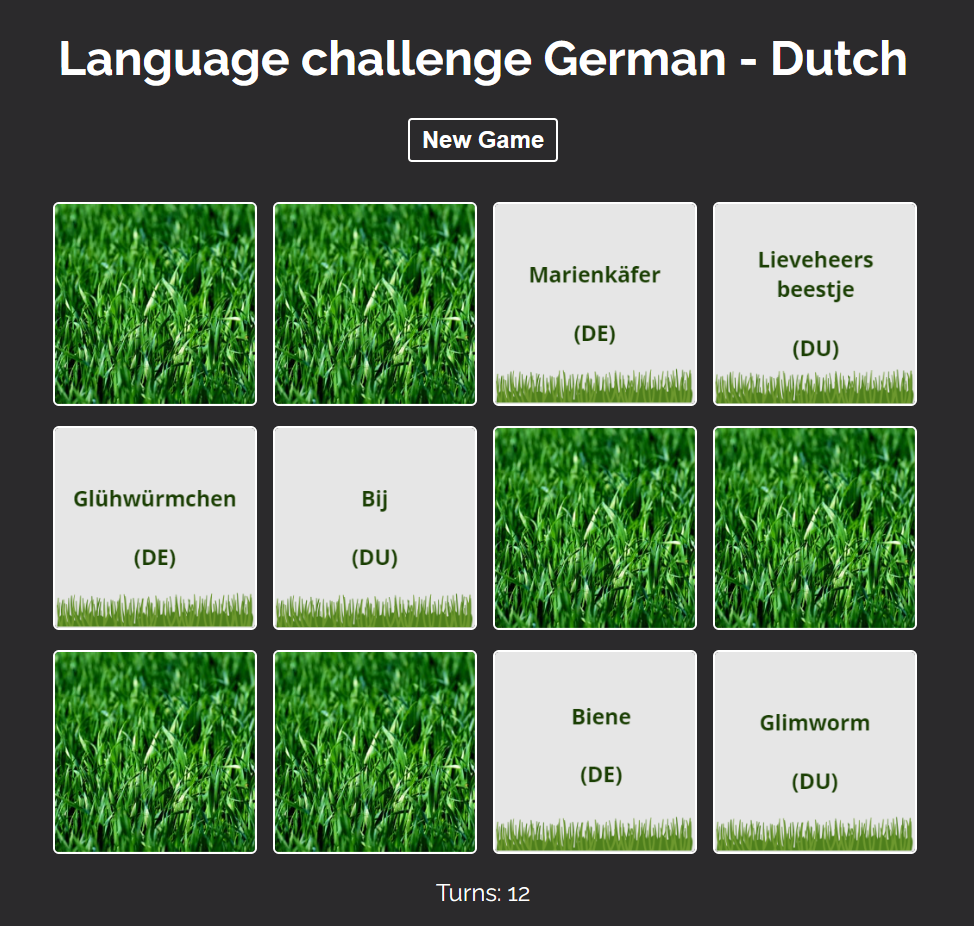

# German - Dutch language challenge (memory game)

For this game, I got inspired by the memo game and created a language challenge.

How to open a project
Clone the link from the repository, paste it into your console, and then use the commands below:

- npm install
- npm run start

## Enjoy!
